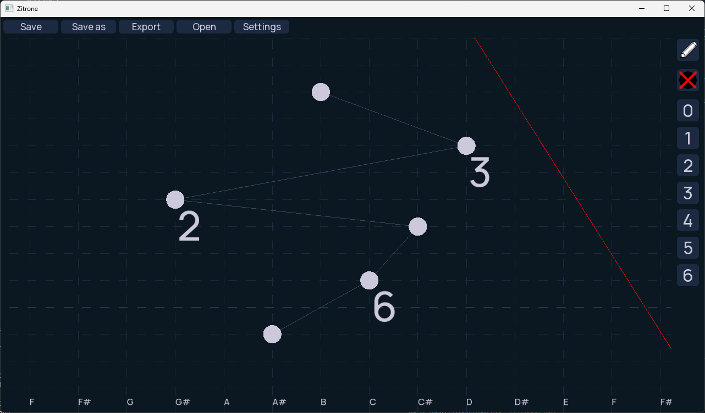

# Zitrone
It's an app for writing notes for musical instrument called zither.
Tested on Windows 11, theoritically should work on Linux too.
In config file, you can customize:

    - language - english and polish are supported, if you want polish replace first line with polski

    - theme - dark, light or industrial

Page size, cut line and spaces between tones are now customizable in app.
# Screenshots



# Building
If you want to build it yourself, you'll need git, cmake and some c++ compiler, preferably G++, since I've had trouble compiling this with msvc and clang.
Then, it's as simple as:
```
git clone https://github.com/K0M0D4/Zitrone.git
cd Zitrone
cmake . -B"build"
cmake --build build
```
And boom, you have compiled version in build directory!
# Licensing
Licenses are in "licenses" directory

This project is under zlib/libpng license: see in License.md